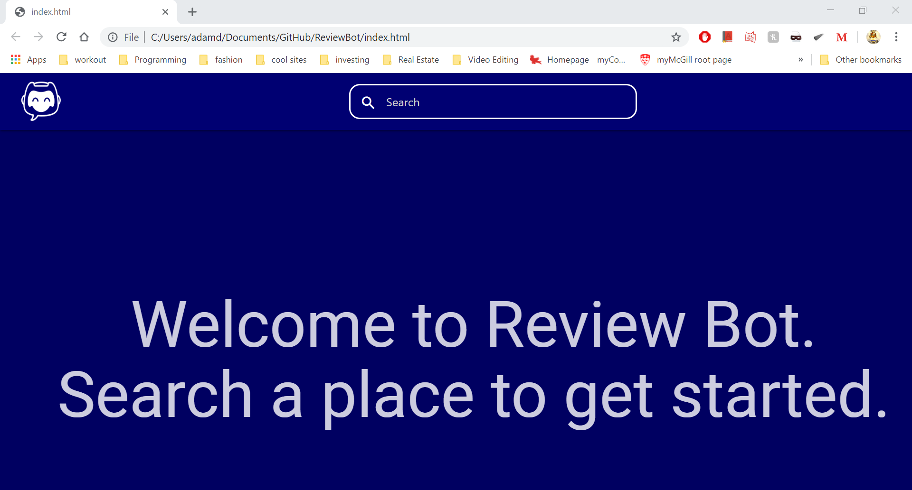
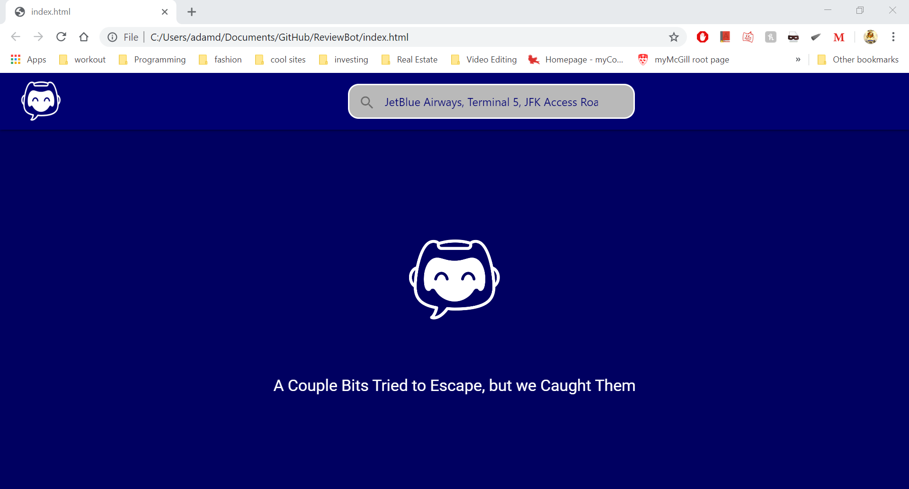
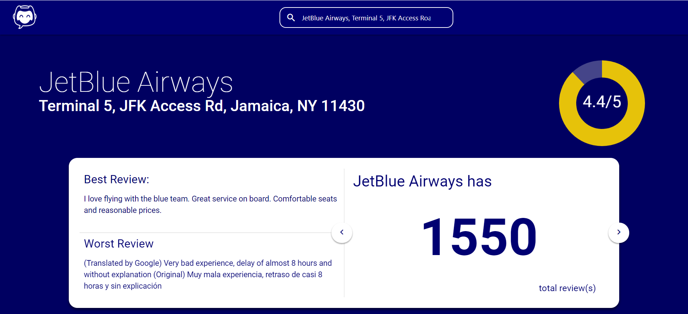
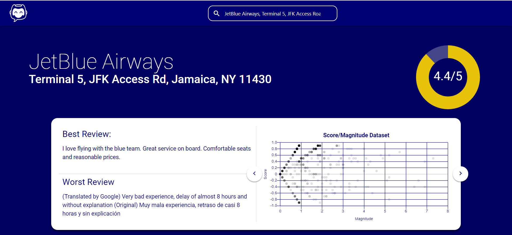
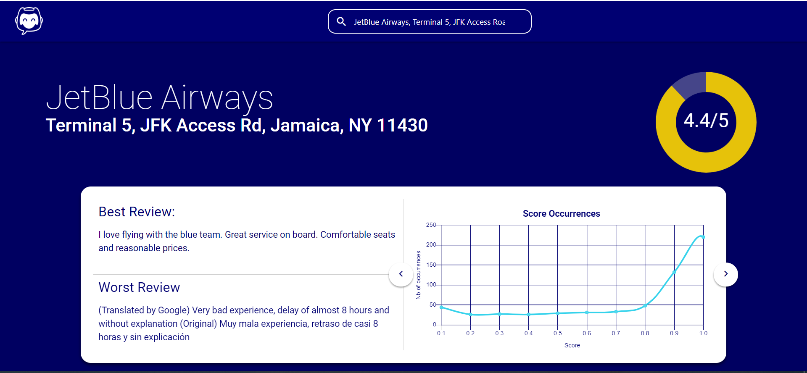

# ReviewBot
Review Bot collects review data from multiple sources and displays relevant information from company ratings. We decided to tackle this project because we wanted to compete in the JetBlue Challenge. The JetBlue Challenge entails navigating through any & all public domain and social media data to get customer feedback of JetBlue Airlines.

## What it does
The main objective of our project is to compile the customer feedback for a given business in a specific location found on Google Reviews and searching through the individual comments to analyze the overall feedback. This works by having the user input the address of their choosing. Said address is then used to extract the data containing the feedback from the Google Places API and subsequently dumps the data onto a ".json" file.

## How we built it
We used Google Places API in our program to collect reviews for businesses. Since this API has its limitations (e.g. we can only retrieve the top 5 reviews per location) we collected the address thanks to Google Places and relayed that information to an Actor for it to scan through all the information and create a .JSON file with everything in it. Afterward, we took that information and, with the help of Google's Natural Language API, ranked the reviews by their sentiment (i.e. how negative or positive each one is) and displayed the data we collected in graphs on our page.

### Built with
* [Ajax](https://api.jquery.com/category/ajax/) 
* [Apify](https://apify.com/) 
* [CSS](https://www.w3schools.com/css/) 
* [Express.js](https://expressjs.com/) 
* [Google-Cloud](https://cloud.google.com/) 
* [HTML](https://www.w3schools.com/html/) 
* [Jquery](https://www.w3schools.com/html/)
* [Node.js](https://nodejs.org/en/) 
* [postman](https://www.postman.com/) 

## Challenges we ran into
The biggest challenge for building ReviewBot was retrieving the data for the feedback, which was mainly due to the limitations of the Google Places API.

## What we learned
We are pleased to have built an asynchronous web application using libraries that we have never used before. Despite encountering a couple of bumps along the way, our web application is a testament to the hard work we put into it.

While working on ReviewBot, we had the opportunity to interact with both sponsors and other participants. Both allowed us to gain greater knowledge about the topics we wanted to implement in ReviewBot. It also gave us a greater appreciation for both parties, as we were glad to see others who displayed as much passion as we did.

## Team

* **Seina Assadian** - [Seina's GitHub](https://github.com/seinaas)
* **Adam DiRe** - [Adam's Github](https://github.com/AdamMigliore)
* **Martin Senécal** - [Martin's Github](https://github.com/martinsenecal)

## What's next for ReviewBot
There are numerous ways that ReviewBot can be updated. Firstly, an upgrade in speed would vastly improve ReviewBot's functionality and performance. Secondly, although ReviewBot uses Google Review to gather the data for the feedback, the implementation of other social media platforms, such as Facebook or Twitter, would push ReviewBot to garner more feedback. Finally, allowing users to create a personal account for the web application would be worth working upon, as users would be able to save their searches onto their accounts, which would boost ReviewBot's reusability.

## Presentation
[Google Slides](https://docs.google.com/presentation/d/1yONNkSyA6z9eiNi-8zRIP_ZpO5LqNRshQEc_ZmgsFU0/edit?usp=sharing)

